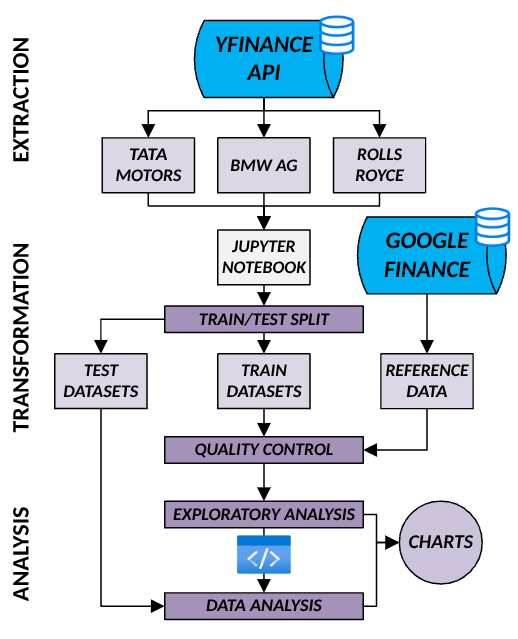

# Forecasting British Automobile Stocks' Price-Trends with ARIMA

## Introduction
This project seeks to determine how market-volatility affects the short-term future price-trends of three British car-manufacturers' stocks, namely TATA Motors, BMW and Rolls-Royce's .

## Literature Review 
Researchers’ perspectives regarding the effectiveness of ARIMA-based share-price forecasting has shifted in recent years. Despite ARIMA’s historical popularity in time-series modelling (Zhang, 2003), current multi-method quantitative studies investigating share-price and demand-modelling have outlined that the technique’s prediction-power and forecast-accuracy were inferior to deep-learning’s (Bousqaoui,
Slimani and Achchab, 2021; Panchal, Ferdouse and Sultana, 2024; Siami-Namini, Tavakoli and Namin, 2018; Adebiyi et al., 2014).

While this consensus on ARIMA’s shortcomings is not universal, with
Ahammad et al.’s (2024) investigation into Apex Food shares demonstrating the contrary, these findings still illustrate ARIMA’s challenges with modelling prices in agitated markets.

## Data Infrastructure
This project used the pandas library's inherent data-quality methods to develop its quality-validation functions, the yfinance API to collect the price-data needed for model-development, the statsmodel package to implement its ARIMA-models, and statistical tests, and the matplotlib module for creating its visualisations. 

## Data Engineering 


Figure 1: Data Pipeline

This project uses yfinance-extracted historical daily close-price data from 01/01/2020 to 31/07/2025 for its price-trend forecasts.  

80% of the data was reserved for model-training, 10% for model-validation and the final 10% for model-testing. 

The train-data was validated against DAMA's six quality-dimensions using custom Python functions. The only data-quality issues the validation-functions found were nulls and inconsistencies. 
```
def NullsDecompose(tables):
  dt = datetime.datetime.strptime
  FORMAT = '%Y-%m-%d'
  COUNT = dt(END, FORMAT) - dt(START, FORMAT)
  COUNT = COUNT.days
  nulls = {'TABLES':[], 'COLUMNS':[], '% NULLS':[]}
  for table, name in tables:
    _table = table.reset_index()
    for col in [*_table]:
      base = _table[col]
      null_vals = COUNT-base[base.notnull()].count()
      nulls['% NULLS'].append(null_vals/COUNT)
      nulls['COLUMNS'].append(col)
      nulls['TABLES'].append(name)
  nulls = pandas.DataFrame.from_dict(nulls)
  return nulls.style.format({'% NULLS':'{:.0%}'})
```
The 32%, 30% and 31% null data populating the TATA, BMW, and Rolls-Royce’s close-price datasets was patched through linear interpolation.
```
def ConsistencyDecompose(tables):
  inconsistent = {'TABLES':[], 'COLUMNS':[], '% MAX INCONSISTENT':[]}
  REFDATA = {
      "TATA Shares" : pandas.read_csv('TATAMOTORS - Reference.csv'),
      "BMW Shares" : pandas.read_csv('BMW - Reference.csv'),
      "Rolls-Royce Shares" : pandas.read_csv('RR - Reference.csv')
  }
  dt = datetime.datetime.strptime
  FORMAT = '%d/%m/%Y'
  for table, name in tables:
      _table = table.reset_index()
      _table['Date'] = _table['Date'].dt.tz_localize(None)
      refsource = REFDATA[name]
      convert_dt = lambda t: dt(t.split(" ")[0], FORMAT)
      refsource['Date'] = refsource['Date'].apply(convert_dt)
      base = _table.merge(right=refsource, how='left', on='Date')
      COUNT = len(base)
      base['MATCH'] = (base['Close_x'] - base['Close_y']).abs()/base.iloc[:,1]
      inconsistent['% MAX INCONSISTENT'].append(base['MATCH'].max())
      inconsistent['COLUMNS'].append('PRICE')
      inconsistent['TABLES'].append(name)
  inconsistent = pandas.DataFrame.from_dict(inconsistent)
  return inconsistent.style.format({'% MAX INCONSISTENT':'{:.0%}'})
```
Since the maximum difference between the yfinance datasets used for this project's data-collection and the Google Finance tables used as this project's reference data was only 3%, no consistency-fixing cleansing action was taken.

## Exploratory Data Analysis
Visualising TATA, BMW and Rolls-Royce's train-datasets' trend and seasonality charts showcased that all three stocks exhibited both periodicity and non-zero trends - two time-series properties that violate ARIMA's non-stationarity assumption (Cheng, 2015; Ryan, Haslbeck, and Waldorp, 2025). Therefore, the data was differenced before being fed to ARIMA models.

Plotting the residuals of the resultant differenced datasets revealed the presence of leptokurtic distributions and outliers, both of which could distort ARIMA's prediction-intervals (Ledolter, 1979; Ledolter, 1989). Therefore, outliers were removed, the resultant nulls were replaced through linear interpolation, and the final outlier-free datasets were transformed through the kurtosis-minimising arcsinh-function to resolve the data's leptokurtic distributions. 

## Data Analysis
The null hypothesis this project posits is that market volatility does not affect TATA, BMW and Rolls-Royce's future price-trends, with the alternative stating that there is some effect.

The Akaike-Information-Criteria (AIC) for different model-orders were compared to determine which ARIMA-models should be used for TATA, BMW and Rolls-Royce's price-trend forecasts. Only model-orders with a differencing level of 0 were considered to reflect the fact that project's train-datasets have already undergone differencing.

Since ARIMA(0,0,3), ARIMA(0,0,2) and ARIMA(3,0,3) minimise the AIC-scores for TATA, BMW, and Rolls-Royce's train-data, respectively, they were chosen as this project's ARIMA-models.

However, ARIMA's predicted price-trends did not seem to fit the stock-price data well. Therefore, the most recent regimes of each of TATA, BMW and Rolls-Royce's close-price data were used to re-train the ARIMA-models, and determine new model-orders.

Although the low square and absolute errors indicated that the models performed well on the test-data, the fact that the error-metrics decrease from the validation-set to the test-set also implies that the test-data was too easy (Sivakumar, Parthasarathy, and Padmapriya, 2014). Future work could explore Bootstrap resampling to increase the test-set's diversity and achieve a more realistic picture of the models' performance (LeBaron and Weigend, 1998). 

Since only some and not all of the p-values for this project's ARIMA model-variables indicate a failure to reject the null hypothesis, the models were not reformulated.

Inspecting the p-values of different statistical tests show that besides ARIMA's residual normality assumption, the other model assumptions were satisfied by the cleaned and transformed datasets.

This project's key findings were it expects with 95% confidence that TATA, BMW and Rolls-Royce's stock-prices will flatten from 01/08/2025 to 15/09/2025. The commercial impact of these findings is that it should motivate British car-businesses to tackle the conservative growth-prospects of the auto-industry.

## Conclusion
This report concludes that market-volatility is predicted to slow down TATA, BMW and Rolls-Royce's price-growth. In the future, further work could be done to assess the reliability of these results.


